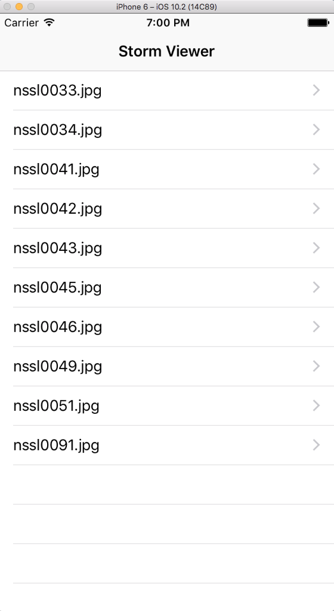
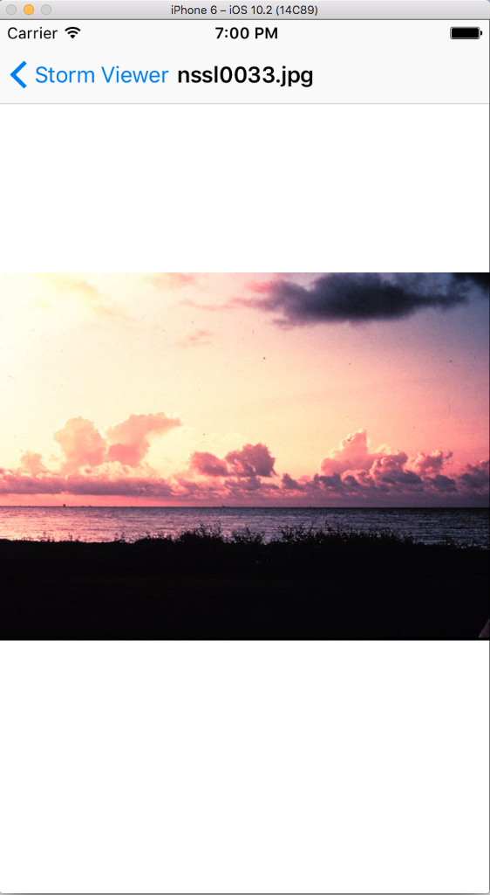

# StormViewer

A very basic app that displays images in a navigation controller.

## Screenshots of the Storm Viewer App

                         Above: Screenshot of the "Main" screen in the Storm Viewer app

                         Above: Screenshot of the "Picture" screen in the Storm Viewer app

Code Source: Hacking with Swift - https://www.hackingwithswift.com

